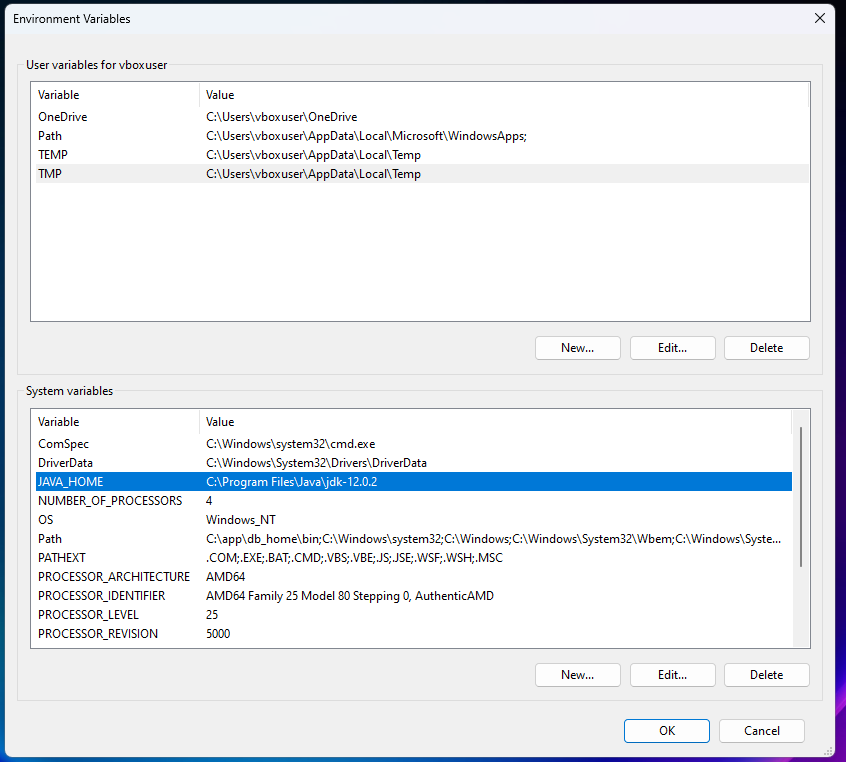
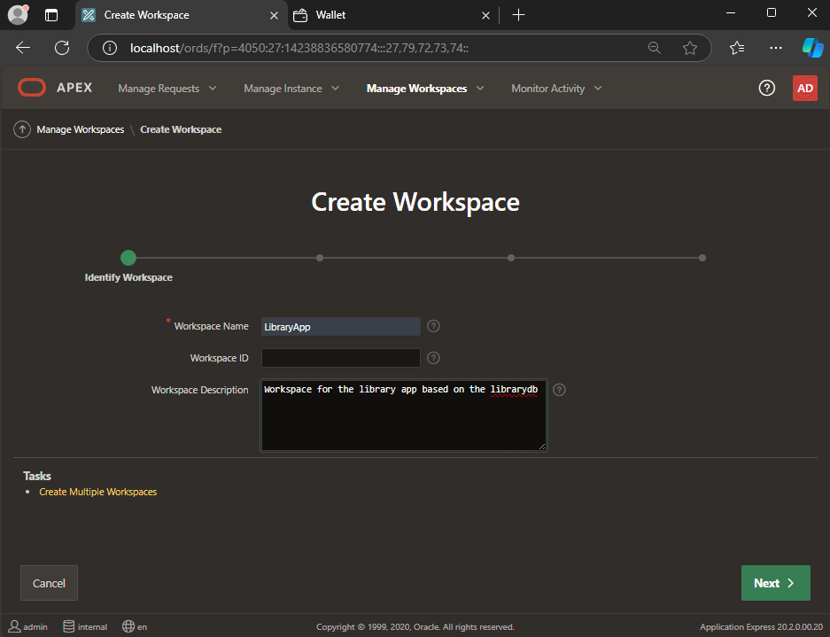

# Oracle Database & APEX Implementation Report
## University Library Database System

---

## 📋 Table of Contents

### 🎯 [Project Overview](#oracle-project-overview)
- [University Library Requirements As a DBA](#university-library-requirements-as-a-dba)
- [Creating a Database Schema](#creating-a-database-schema)
- [Oracle's Data Modeler](#oracles-data-modeler)

### 🗄️ [Oracle Database Overview](#oracle-database-overview)
- [Oracle Database Advantages](#oracle-database-advantages)
- [Virtual Machine Setup](#virtual-machine-setup)
- [Database Installation & Configuration](#database-installation--configuration)
- [Database Installation Process](#database-installation-process)
- [Creating a new PDB](#creating-a-new-pdb)
- [Configuration of Networking Files](#configuration-of-networking-files)
- [Navigation to & from PDBs and Setting to Boot-Up on Default](#navigation-to--from-pdbs-and-setting-to-boot-up-on-default)
- [Creating SQL connection in SQL Developer](#creating-sql-connection-in-sql-developer)
- [Implement ERD using SQL Developer](#implement-erd-using-sql-developer)
- [Inserting Data into Tables](#inserting-data-into-tables)

### 🚀 [Overview Of Oracle APEX](#overview-of-oracle-apex)
- [What is the Architecture Used?](#what-is-the-architecture-used)
- [What is the RAD stack?](#what-is-the-rad-stack)
- [Oracle RAD Stack in Action](#oracle-rad-stack-in-action)
- [Installation of Oracle Apex on LibraryDB PDB](#installation-of-oracle-apex-on-librarydb-pdb)

### ⚙️ [Backend Setup for Oracle APEX](#backend-setup-for-oracle-apex)
- [ORDS & Tomcat, Summary & Interaction](#ords--tomcat-summary--interaction)
- [Apache Tomcat Setup](#apache-tomcat-setup)
- [Workspaces in APEX](#workspaces-in-apex)

### 💻 [Simple CRUD Operations Using APEX](#simple-crud-operations-using-apex)
- [Creating an Application in APEX](#creating-an-application-in-apex)
- [Creating a Report with Form Page In APEX](#creating-a-report-with-form-page-in-apex)
- [Creating a View for Data in APEX's SQL Workshop](#creating-a-view-for-data-in-apexs-sql-workshop)

### 🎓 [IT Support for Student Registration](#it-support-for-student-registration)

### 📊 [Internship Assessment & How It Prepared Me](#internship-assessment--how-it-prepared-me)
- [Technical Skills & Experience](#technical-skills--experience)
- [Difference Between Theory & Practice](#difference-between-theory--practice)
- [Soft Skills & Teamwork Skills](#soft-skills--teamwork-skills)

### 🎯 [Conclusion](#conclusion)

### 📚 [References](#references)

---

## Oracle Project Overview

The assigned project aims to provide a holistic learning experience about Oracle databases. The project aims to create a library database for a university with the following criteria:

### 🎯 Project Objectives

1. **Requirements & Design**
   - Collect requirements and create an ERD Diagram and Schema for the Database

2. **Database Installation**
   - Install and create an Oracle database that is compatible with Windows 11 in a virtual machine using Oracle VirtualBox

3. **PDB Configuration**
   - Create a pluggable database and have it load in read write mode on database start

4. **Implementation**
   - Implement Database Diagram into Oracle Database

5. **Connection Setup**
   - Create SQL Developer connection to the newly created database
   - Establish an SQL Developer connection so that mock data can be inserted easily into the database

6. **APEX Configuration**
   - Perform the Necessary Setup for Developers to Use Oracle APEX for development based on Created Database
   - Create a Workspace and Administrator

7. **Application Development**
   - Make simple CRUD operations on Database using APEX

> **Note:** Although APEX development itself will not be extensive in this project, the aim is to test functionality and get the basics of developing applications using the platform. The main goal is to create a setup to be used by future developers and interns at Al-Ain University to continue the work later on.

---

## University Library Requirements As a DBA

After discussions with the university library staff & some of my colleagues, the following scenario has been constructed after approval from project supervisor:

### 📖 System Components

The library system is composed of:
- **Employees** - responsible for bookkeeping and handling students
- **Students** - using the library services
- **Books** - library inventory
- **Library Administrator/Manager** - system oversight

### 👥 Role Responsibilities

#### **Employees**
- Handle student book borrowing and returning
- Register all details on the system
- Classify books to appropriate categories
- Send reminders to students for book returns
- Specify book names in reminders

#### **Books**
- Have authors and publishers with attached IDs
- Belong to a single category for library sectioning
- Placed in specific sections around the library

#### **Library Administrators/Managers**
- Manage employees and add them to the system
- Responsible for acquiring new books
- Register new books on the system or remove them
- Issue fines to students after warnings for overdue books

---

## Creating a Database Schema

The initial database design is simplistic in design and focused on separating each entity on its own and where only primary keys link the tables together and adhering to database design principles.

### 🔧 Database Normalization

Database normalization is a necessary step to avoid data redundancy and guaranteeing data integrity in any database. It can simplify database maintenance, management and make queries easier to construct for developers. In addition, Normalization avoids anomalies such as insertion, deletion and update anomalies.

### 📊 Schema Tables

#### Admin
| Column Name | Data Type | Constraints |
|-------------|-----------|-------------|
| **Admin_ID** | Primary Key | **PK** |
| First_Name | VARCHAR | |
| Last_Name | VARCHAR | |

#### Employee
| Column Name | Data Type | Constraints |
|-------------|-----------|-------------|
| **Employee_ID** | Primary Key | **PK** |
| First_Name | VARCHAR | |
| Last_Name | VARCHAR | |
| Manager_ID | Foreign Key | **FK** |

#### Student
| Column Name | Data Type | Constraints |
|-------------|-----------|-------------|
| **Student_ID** | Primary Key | **PK** |
| First_Name | VARCHAR | |
| Last_Name | VARCHAR | |
| Major | VARCHAR | |

#### Books
| Column Name | Data Type | Constraints |
|-------------|-----------|-------------|
| **Book_ID** | Primary Key | **PK** |
| Name | VARCHAR | |
| Category | VARCHAR | |
| Author_ID | Foreign Key | **FK** |
| Publisher_ID | Foreign Key | **FK** |
| Supplier_ID | Foreign Key | **FK** |

#### Publisher
| Column Name | Data Type | Constraints |
|-------------|-----------|-------------|
| **Publisher_ID** | Primary Key | **PK** |
| Publisher_Name | VARCHAR | |
| Publisher_Address | VARCHAR | |
| Publisher_Email | VARCHAR | |

#### Supplier
| Column Name | Data Type | Constraints |
|-------------|-----------|-------------|
| **Supplier_ID** | Primary Key | **PK** |
| Supplier_Name | VARCHAR | |
| Supplier_Address | VARCHAR | |
| Supplier_Email | VARCHAR | |

#### Author
| Column Name | Data Type | Constraints |
|-------------|-----------|-------------|
| **Author_ID** | Primary Key | **PK** |
| First_Name | VARCHAR | |
| Last_Name | VARCHAR | |
| Author_Email | VARCHAR | |
| Author_Address | VARCHAR | |

#### Reminder_Records
| Column Name | Data Type | Constraints |
|-------------|-----------|-------------|
| **Reminder_ID** | Primary Key | **PK** |
| Student_ID | Foreign Key | **FK** |
| Employee_ID | Foreign Key | **FK** |
| Book_ID | Foreign Key | **FK** |

#### Borrow_Records
| Column Name | Data Type | Constraints |
|-------------|-----------|-------------|
| **Borrow_ID** | Primary Key | **PK** |
| Student_ID | Foreign Key | **FK** |
| Book_ID | Foreign Key | **FK** |

#### Fine_Records
| Column Name | Data Type | Constraints |
|-------------|-----------|-------------|
| **Fine_ID** | Primary Key | **PK** |
| Student_ID | Foreign Key | **FK** |
| Admin_ID | Foreign Key | **FK** |

### 📈 Initial ERD Diagram

The database design was also re-created in an ERD diagram to show the relationships between entities more clearly using draw.io.


*Figure 1: Initial library ER diagram after normalization*

### ⚠️ Identified Issues

However, after debriefing and showing progress made, a problem was encountered in that the database schema is not appropriate for scalable projects. Three fatal flaws were discovered:

1. **Static Entity Assumption** - I assumed that the database entities would be static, meaning no new types of entities or users would be created

2. **Data Redundancy** - Even after normalization, there is still a lot of repetition of basic attributes such as first name and last name, email etc. for many users in the database

3. **Missing Role Management** - Third flaw was not having any roles assigned to the entities, students do not have the same privileges or access as an employee or library admin

### 💡 Solution Implementation

To fix these problems, a solution was devised where the students, library admins/managers, employees and any future entities (for example, external visitors not enrolled in the university) could use the system without any major restructuring on the database.

The solution was creating a **users table**, that would contain any and all users of the system and a **role table** that stores the different roles (that would also include any future potential roles in case the library had an expansion or different positions of different access levels was introduced), and each different actor or user would have its separate attributes in a separate mini table only containing the data it needs.

This also introduced a perfect opportunity to learn and use one of Oracle's tools for database modelling specifically catered to Oracle's database infrastructure.

---

## Oracle's Data Modeler

Oracle's data modeler allows you to create ERD diagrams with attributes having specified primary and foreign keys relationship shown more clearly than a simple diagram on draw.io, with each attribute shown how it will be stored in an Oracle Database.


*Figure 2: Re-designed ERD diagram on Oracle's Data Modeler*

Using the data modeler enabled a better vision of the system as a whole and a better understanding of how attributes should be stored and dealt with in the database to be later implemented in Oracle's Database.

---

## Oracle Database Overview

According to Oracle's Database Documentation [1], Oracle Databases since 12c edition introduced an architecture change in their databases, introducing concept database (CDB) and pluggable database (PDB) in their multitenant architecture.

### 🏗️ Multitenant Architecture

Multitenant architecture allows every oracle database to be a container database (CDB) containing one or more user generated pluggable databases (PDBs). The benefits of which will be illustrated after explaining how the oracle multitenant architecture operates.


*Figure 3: Illustration of a CDB with all of its internal components*

### 🔧 Oracle Database Components

Oracle Databases have the following components:

- **System Container** - One system container
- **CDB Root Container** - One CDB root container  
- **Seed PDB** - One seed PDB only
- **User-generated PDBs** - Zero or more than one
- **Application Containers** - Optional (zero or more than one)

#### Component Details

| Component | Description |
|-----------|-------------|
| **System Container** | A logical container for everything in the database including all PDBs, containers, roots and seeds |
| **CDB Root Container (CDB$ROOT)** | A collection of schemas, objects, schema objects that all PDBs belong to. Contains oracle supplied system metadata required to manage PDBs such as source code for PL/SQL packages and common users |
| **Application Containers** | Operate as a Mini-CDB meant for a specific application within the larger database, but cannot operate by itself and requires to be plugged into the root CDB |
| **PDB Seed (PDB$SEED)** | A "system-supplied template" used to generate and create new PDBs in the database |
| **PDBs** | Contain schemas, objects, and information that is user-generated that is self-contained and managed. Can be migrated, added and removed at will from the CDB root without affecting each other [3] |

---

## Oracle Database Advantages

### 🎯 Key Benefits

#### 1. **Data Consolidation**
First is data consolidation, meaning it becomes far easier to relocate data from multiple databases into one, making it easier to migrate data and manage it without altering any schemas or affecting any applications in the process.

#### 2. **Better Resource Management** 
Second is better resource management with better flexibility and data management compared to other alternatives such as: virtual private databases, virtual machines or placing multiple databases. This is due to its architecture and encapsulation and ease of migration for data.

#### 3. **Easier Management**
Third, easier management of a database. This is achieved by the multitenant architecture that provides an easier migration between servers and protection against data corruption and ability to have actions be done to a specific PDB (upgrades, reverses, etc) without affecting the other PDBs. A Database Administrator can assign an administrator to a specific PDB with limited privileges resulting in better security as well as many other benefits [4].

---

## Virtual Machine Setup

### ⚙️ VM Configuration

Virtual Machine (VM) was set up using Oracle's Virtual Box with default settings using Windows 11 Pro, as it is compatible with Oracle Database 19c [5]. 

#### **System Specifications**
| Resource | Allocation |
|----------|------------|
| **Operating System** | Windows 11 Pro |
| **RAM** | 8GB |
| **Video Memory** | 256 MB |
| **CPU Cores** | 4 |
| **Storage** | 80 GB |

### ⚠️ Required Precautions

Precautions had to be taken in order to ensure adequate performance and not affect the VM's integrity or run into any unforeseen problems that are caused by Windows default virtualization being enabled or some Windows systems that could cause problems. 

#### **Disable the following Windows features:**
- Hyper-V
- Memory Integrity
- Secure Core
- CredentialGuard
- Windows Defender's Core Isolation
- Memory Protection

> **Source:** Scott Gus on Oracle's virtual forums [6]

---

## Database Installation & Configuration

### 📋 Prerequisites

In order to successfully install Oracle Database 19c, the following prerequisites are needed:

#### **Microsoft C++ Packages**
- MS Visual C++ 2008 Redistributable Packages
- MS Visual C++ 2012 Redistributable 11.0.61030
- MS Visual C++ 2010 RUNTIME LIBRARIES WITH SERVICE PACK 1 x64
- MS Visual C++ 2010 RUNTIME LIBRARIES WITH SERVICE PACK 1 x86

#### **Java Requirements**
- Java JDK 12 (JDK 8 or above in general)
- Setup with default settings with installation in C:\ drive
- Set the path and environmental variables and PATH

### 🔧 Environment Setup


*Figure 4: Setup for environmental paths for both database and java*


*Figure 5: Setting up the environment path for Java 12.0.2*

---

## Database Installation Process

### 📁 File Organization

1. Copy the zip folder for Oracle DB 19c (Named `WINDOWS.X64_193000_db_home`)
2. Create a new folder named "Oracle" on C: Drive 
3. Inside create a folder named "Oracle DB" to store Oracle Database 19c
4. Paste the zip folder into it and extract it
5. Rename the extracted folder `db_home`

> **Important Notes:**
> - Keep consistency with everything being installed into proper folders and having proper folder naming to avoid errors
> - For testing purposes **Oracle1234** will be the password for almost everything except for Oracle Apex which will be **Oracle_1234**
> - All commands will be run in terminal or programs will be run as administrator

### 🗄️ Database Configuration


*Figure 6: Configuration of the database, creating a container database named "orcl" with a pluggable database named orclpdb*

---

## Creating a new PDB

Creating a PDB can be done through the terminal with SQL commands through Oracle's SQLPLUS, another solution is to use Database Configuration Assistant (DBCA) with a GUI which has been used for this project as the design is more intuitive and allows for better control.

### 🔧 DBCA Wizard Steps


*Figure 7: First step to create a PDB for our library database*


*Figure 8: Container database selection*


*Figure 9: Pluggable database template used pdb$seed (oracle default pdb template)*


*Figure 10: PDB Details & Credentials with password shown in the Run Window*


*Figure 11: Database Location and Method of Storage for Database*

After this step, the pluggable database will be successfully created and the DBCA program will terminate and the next step will be to verify that the pluggable database has been created using Oracle's SqlPlus through the command prompt.

---

## Configuration of Networking Files

In order for the newly created PDB to function properly, we need to provide it with networking in order to connect to it properly.


*Figure 12: Showing LibraryDB as a pdb in the container and its service name*

The figure 12 shows the service name which will be used to set up the network configuration of the database to allow for connection from SQL developer later on.

### 🌐 Network Configuration

Oracle's databases operate on their own networking, requiring modifications to said files in order to connect to the pluggable databases, create tables, enter data and conduct other operations on them.

Oracle's database has SQLNet or Net Services that it operates its connections using. For the purposes of this project only the `tnsnames.ora` file is dealt with. The `tnsnames.ora` file is responsible for client side network configuration [7].


*Figure 13: tnsnames.ora file & additions made to it at the end (LIBRARYDB)*

### 📝 Network Configuration Explanation

| Component | Description |
|-----------|-------------|
| **"LIBRARYDB", "ORCLPDB", "ORCL"** | Network service alias used by clients when connecting to the service or PDB |
| **"(DESCRIPTION = ...)"** | Details to connect to the oracle database and wrapper for all required components |
| **"(ADDRESS = ...)"** | Network address specifying where the client should look for the Oracle service |
| **"PROTOCOL = TCP"** | Specifies which protocol is used |
| **"HOST = localhost"** | Refers to where the host is running the database |
| **"PORT = 1521"** | TCP port number for oracle database connection (default) |
| **"(CONNECT_DATA = ...)"** | Contains connection data for the oracle service |
| **"(SERVER = DEDICATED)"** | Tells client which server connection to use |

> **Summary:** Any client that specifies that they wish to connect to Library Database with the service name of librarydb will connect using TCP Protocol on the localhost (using IP 127.0.0.1) and using port 1521 and it will create a dedicated server process for each client connection to the database.

---

## Navigation to & from PDBs and Setting to Boot-Up on Default


*Figure 14: SQL commands to open up pluggable databases & set librarydb to open mode and save its state on bootup for next time*

### 🔧 SQL Commands Explanation

| Command | Description |
|---------|-------------|
| `show pdbs;` | Command to show pluggable databases |
| `alter pluggable database librarydb open;` | To open it in read and write mode |
| `col CON_NAME for a15;` | Format the display of query results |
| `select con_name, state from dba_pdb_saved_state;` | Shows pdbs that have saved state |

#### **Column Formatting Details:**
- `col` - shorthand for column
- `con_name` - short for container name (both PDB & CDB)
- `for a15` - a stands for alphanumeric data and 15 specifies 15 characters as the width of the column


*Figure 15: PDB librarydb in read & write mode after shutting down the database*

As Figure 15 illustrates, it shows the database successfully saved the state of the library database while discarding Oracle's default pdb (orclpdb) and only leaving librarydb in read and write mode.

---

## Creating SQL connection in SQL Developer

SQL Developer is an IDE created by Oracle for Database management that can be used for running SQL Queries easily and designing database schemas among other tasks in GUI Interface.


*Figure 16: SQL Developer tool while connecting to the library's PDB*

### 🔌 Connection Configuration

| Parameter | Value | Description |
|-----------|-------|-------------|
| **Connection Name** | Custom name for the connection |
| **Username** | sys | User with sysdba privileges |
| **Password** | Oracle1234 | Set during installation |
| **Role** | SYSDBA | Administrative privileges |
| **Hostname** | localhost | VM is hosting the PDB |
| **Port** | 1521 | Default Oracle port |
| **Service Name** | librarydb | As defined in tnsnames.ora |

> **Additional Setup:** A connection was made to the CDB to unlock an additional account which will be used by Oracle Apex and the default orclpdb for testing purposes.

---

## Implement ERD using SQL Developer

The schema for the database will be created using a new user to avoid any pollution/damage to the oracle schemas and internal tables that are used by database, as such all new tables that will be created will be done using the new user who will carry all the tables called **"LIB_ADMIN"** with the password of **Oracle1234**. 

> **Best Practice:** Every user has their own schema and it is considered best practice to create a user for every new schema created.


*Figure 17: New user to hold the library schema being created successfully*


*Figure 18: Database connection in SQL developer*

### 🛠️ Implementation Options

Implementing the diagram in Oracle Database can be done in multiple ways:

1. **Manual SQL Coding** - Write the SQL code by hand following guidelines and best practices
2. **Oracle's SQL Developer Data Modeler** - Diagram visually and convert to SQL code for database implementation

---

## Inserting Data into Tables

Dummy data that I have made will be used for this project and then inserted into the database. While most databases such as PostgreSQL, MySQL, SQL Server have a unified traditional way of inserting data in bulk (multiple rows into the same table), Oracle Databases operate differently.


*Figure 19: Bulk data insertion method*

### 🔄 Oracle-Specific Bulk Insert

While the query is self explanatory, the last statement: `SELECT * FROM dual;` is required in order to execute the previous SQL statements successfully. 

#### **Why `dual` table is needed:**
- The structure is designed to pull data from selected table and insert into other tables
- Since we exclusively want to insert data into the "USERS" table
- We specify a dummy table in oracle called "dual" 
- Run our previous statements without inserting data from any other table
- This is the usual workaround solution for oracle databases

### 💡 Best Practices

It's generally preferable to insert data in bulk to:
- Save time during insertion
- Ensure that if any statement fails, you can locate and fix it
- Avoid accidental data replication by possibly running some statement twice

> **Note:** Rest of the mock data was inserted using this method. Other queries are generally similar in Oracle's SQL to traditional SQL. However, this was the biggest divergence found while working on this project.

---

## Overview Of Oracle APEX

Oracle APEX (Application Express) is a low code development platform that enables you to build scalable, secure, enterprise apps that are easy to deploy online for audiences worldwide. 

### 🌟 Key Capabilities

- **Multi-Platform** - Works on cloud and connects to databases of any kind
- **Flexible Data Sources** - Natively on devices using installed databases or simple spreadsheets  
- **Rapid Development** - Generates applications using default templates
- **Customizable** - Easy to modify and build from scratch while allowing customizability

---

## What is the Architecture Used?

APEX architecture is a three-tier web application architecture consisting of the client, the middle tier ORDs (Oracle REST Data services), and Database Tier. These systems are called the Oracle RAD Stack.


*Figure 20: Illustration of Oracle RAD Stack & Three Tier Architecture*

---

## What is the RAD stack?

**RAD** stands for:
- **R** - REST Data Services
- **A** - Oracle's APEX  
- **D** - Oracle Database

This stack provides all the components needed to build scalable web applications without needing additional parts with Oracle APEX & ORDS being pre-existing features of Oracle Database since 12c and above.

---

## Oracle RAD Stack in Action

### 🔄 Process Flow

1. **Client Access** - The client accesses the web app through a URL
2. **ORDS Processing** - ORDs request/submit data to the database tier
3. **Database Operations** - The database tier contains:
   - Data schemas with metadata necessary to operate Oracle APEX
   - Created application and Oracle APEX Engine inside the database backend
4. **PL/SQL Execution** - Oracle database operates on PL/SQL (procedural programming language based on functions executed in sequence) and SQL

---

## Installation of Oracle Apex on LibraryDB PDB

### 📋 Installation Requirements

- **Version Used:** Apex 20.2 (compatible with Oracle Database 19c)
- **Source:** Downloaded from Oracle's official website
- **Prerequisites:** Open cmd as admin, navigate to apex files, open SQLPLUS, connect to PDB


*Figure 21: Navigation to apex files & setting session to librarydb*

### 🗄️ Required Tablespaces

When installing Oracle APEX, there are four tablespaces required as per Oracle Apex installation manual [9]:

| Tablespace | Purpose |
|------------|---------|
| **1. APEX Schemas** | For Apex users schemas and objects storage |
| **2. APEX User Files** | For Apex user files specifically |
| **3. Temporary Tablespace** | For temporary tablespaces or groups |
| **4. Images** | For Apex images and/or resources |

### ⚡ Installation Command

```sql
@apexins.sql SYSAUX SYSAUX TEMP /i/
```

> The command used was the default one as provided by the Apex installation manual but can be modified according to the installer's desires.


*Figure 22: Successful installation of Oracle Apex*

### 👤 Admin User Creation

Create an admin user and their password through an SQL file called `apxchpwd.sql` (Apex change password sql file).


*Figure 23: Apex Admin creation with password of Oracle_1234*

### 🔧 REST Configuration

Run `apex_rest_config` script to setup the REST config users and add their passwords (Oracle_1234).


*Figure 24: Successful creation of the users with password Oracle_1234*

### 🔓 Account Unlocking

The following users need to be unlocked and have passwords changed using SQL Developer:
- `apex_200200`
- `apex_instance_admin_user` 
- `apex_listener`
- `apex_public_user`
- `apex_rest_public_user`

**SQL Command:**
```sql
alter user [apex_user] identified by Oracle_1234 account unlock;
```


*Figure 25: Command used and results from unlocking the account*

### 🔐 Anonymous Account

The final account to unlock is `anonymous` which can be unlocked by connecting to the CDB instead of PDB.


*Figure 26: How to switch connections between PDBs and CDB*

After connecting to the CDB successfully, unlock the anonymous account with the same command used previously but replace the user account's name with `anonymous`.

---

## Backend Setup for Oracle APEX

## ORDS & Tomcat, Summary & Interaction

To facilitate the hosting of applications for development, **Apache Tomcat** is a web server that was used for its lightweight and compatible and easily configurable properties with Oracle Databases. 

### 🔄 Integration Process

| Component | Role |
|-----------|------|
| **Tomcat** | Facilitates the deployment of ORDS, handles HTTP requests from users |
| **ORDS** | Acts as a bridge between the database and web applications, deployed as a java servlet in Tomcat |
| **Database** | Processes SQL or PL/SQL interactions routed through ORDS |

**Flow:** Tomcat handles HTTP requests from users → routes them to ORDS → ORDS handles it as SQL or PL/SQL → interacts with database

---

## Apache Tomcat Setup

Apache Tomcat is an open-source web server used for Java-based applications. Built on Java technologies, Tomcat acts as a connector between the servers and the java applications facilitating lightweight management & processing of client requests. It is easy to install and configure and compatible with Oracle Database 19c [10].


*Figure 27: Configuration of tomcat during installation*

### 🔧 ORDS Integration Steps

1. **File Deployment** - Copy the `ords.war` file to the tomcat web app folders
2. **Server Installation** - Install on the server 
3. **Database Configuration** - Configure for Oracle Database


*Figure 28: Proper Installation of Oracle Apex With Final Prompt*


*Figure 29: Sign-in page for Apex using username and password setup during installation showing after successful installation & configuration of ORDS*

---

## Workspaces in APEX

**Workspace** is a logical area in Oracle Apex that allows users to create and run APEX applications. Each workspace is associated with a database schema acting as a source for the data, with each workspace having its own users and developers and administrators.

### 🏗️ Workspace Creation Process


*Figure 30: First step into creating a workspace in APEX*


*Figure 31: Oracle Workspace being created*


*Figure 32: Creating a workspace administrator*


*Figure 33: Completed workspace creation*

### ⚙️ Workspace Configuration Details

| Step | Configuration | Purpose |
|------|---------------|---------|
| **1. Workspace Details** | Name and description assignment | Workspace identification |
| **2. Schema Assignment** | Pre-existing schema (Lib_Admin) | Data source for applications |
| **3. Administrator Setup** | Workspace administrator creation | User management and development access |

---

## Simple CRUD Operations Using APEX

Simple application through Oracle's APEX to verify the functionality of APEX itself and test if CRUD operations are functional and to illustrate the features of Oracle APEX.

---

## Creating an Application in APEX

After successfully creating a workspace, we log out of APEX and sign back in as the workspace administrator and then create an application from the Create button on the Apex App Builder (as shown in figure 34) and create a new application based on the library schema created earlier in the project.


*Figure 34: Showing the create button on far left in APEX*


*Figure 35: Creating a new application using APEX's wizard for functionalities testing*

---

## Creating a Report with Form Page In APEX

The simple UI for APEX allows you to create a page in the application. The goal is to create a simple page that allows you to add a user to the user table in the schema. This is done by clicking on the "Create Page" button, then selecting "Form", then "Form with Report" as shown in figures 37 and 38 respectively.

### 🔧 Page Creation Process

The wizard for creating the pages involves hiding of ROWID which is APEX's default primary key. Enabling ROWID is necessary to make modifications directly on the report which affects the data in the database. However, for this implementation, it was changed to not allow modifications - changed to classic report and disabled showing ROWID.


*Figure 36: Showing the UI for APEX's App Builder*


*Figure 37: Showing the wizard for creating a new page in an APEX application*


*Figure 38: Showing the next step in the page creation wizard*


*Figure 39: Continuation of the wizard*


*Figure 40: Showing the modifications needed to make the report not editable and disabling of the default ROWID column*

### 📊 Final Implementation Results


*Figure 41: Showing the finished reports*


*Figure 42: Showing the form with test user input*


*Figure 43: Showing the test user shown in APEX report as a library user*

### ✅ Database Verification

To ensure that the user is created and inserted into the database, we verify using SQL Developer that APEX is indeed functional.


*Figure 44: Showing the test user from APEX inserted into the database separately from APEX*

---

## Creating a View for Data in APEX's SQL Workshop

**Views** are a way of showing data from multiple tables and creating an output and then treating it as if it's a separate table. They are a useful shortcut to reusing the same SQL statements to display data.

### 🛠️ View Creation Process

Views are accessed from SQL workshop, then clicking on the create side menu to make a new view. We will utilize this view for a classic report similar to the previous section, but this time to see the employees and their data by combining users table and employee table in a single view and then a form that adds employees but only if they are already pre-existing in users table and they have role ID = 2, so that they only can add existing employees in the user table.


*Figure 45: Showing the steps to create a view in APEX*


*Figure 46: Showing SQL code to create the view*


*Figure 47: Using the newly created view and including all columns except for role*

### 🎛️ Form Field Configuration


*Figure 48: Showing how to modify the form field P3_EMP_ID to a Popup LOV selection*


*Figure 49: Setting the value for the Popup LOV to show the ID's of employees only*

### 📋 Final Results


*Figure 50: Showing the final result of the page*


*Figure 51: Showing the Pop-up LOV Function implemented with only registered employees accounts that can be activated*

---

## IT Support for Student Registration

The last part of my journey was working as IT support for students and anyone who needed assistance in the last month of my internship.

### 📚 Training and Preparation

We were debriefed on the following systems and their possible errors:
- **Banner** - Student information system
- **Moodle** - Learning management system  
- **Microsoft Teams** - Communication platform
- **Email systems** - Both Outlook and Gmail

After debriefing we were immediately set to have posts around the registration office and at the IT center's front desk in case anyone needed assistance.

### 🎓 Common Student Issues

#### **Older Students (30+)**
Many older students, especially in masters and doctorate programs, were unaware of:
- How their university emails worked
- That they had a university email to begin with

**Solution:** We helped them by showing them how to access emails and enable notifications to receive them.

#### **New Students**  
Newly registered students faced issues with:
- Unknown passwords
- How to change passwords
- Feeling overwhelmed by the systems

**Solution:** We helped them through their problems and got them accustomed to the systems, showed them how to view course information and contact details from the banner system.

#### **Account Issues**
Some students had locked accounts due to:
- Financial issues
- Being inactive for too long
- Pausing studies for extended periods

**Solution:** We took them to the IT Center, verified the account was locked, then sent them to the general registrar's office to resolve the issue.

#### **Special Registration Requirements**
Some students needed:
- Registration for courses outside their study plan
- Help with low GPA registration restrictions

**Solution:** These circumstances required intervention from the general registrar and signatures/approval from respective department heads.

### 💡 Efficiency Solutions

Due to the high volume of students with similar questions about accessing Moodle and Banner, I created efficiency solutions:

1. **WhatsApp Messages** - Created guides as messages that could be forwarded to students' phone numbers
2. **Google Document with QR Code** - When WhatsApp became unmanageable, created a comprehensive guide with screenshots and steps, then printed QR codes directing to the document's URL

---

## Internship Assessment & How It Prepared Me

## Technical Skills & Experience

Learning how to manage, install, and configure middleware software for Oracle databases and Oracle suite and Oracle APEX has given me a distinct advantage and a viable career path after my internship and graduation.

### 🏆 Key Achievements

| Skill Area | Details |
|------------|---------|
| **Oracle Certification Alignment** | Most work achieved overlaps with Oracle's pre-existing learning path for their certificates |
| **Practical Experience** | Skills learned can be translated into actual working and productive experience |
| **Self-Sufficiency** | Ability to work through documentation independently |

### 💼 Most Vital Skill Learned

The most vital skill learned is **working through documentation** and being able to use it to:
- Install and configure systems
- Create and implement solutions
- Debug and troubleshoot work thoroughly
- Understand software/coding language operation
- Be self-sufficient without relying on others

---

## Difference Between Theory & Practice

While I have dealt with many of the topics discussed in the internship over the course of my studies, the contrast between them remains clear. While my studies have given me the basic blocks and concepts and ability to begin working, the internship has given me a challenge in terms of thinking of scalable and efficient software that can deliver results in an optimized way.

### 🎯 Key Contrasts

#### **Database Schema Design**
| Academic Approach | Professional Approach |
|-------------------|----------------------|
| Static requirements that never change | Scalable design for changing requirements |
| Simple normalization exercises | Forward thinking for expansions |
| Theoretical perfect scenarios | Real-world adaptability considerations |

**Example:** When tasked with creating a schema in academics, requirements would always be static, never requiring scalable design or forward thinking for expansions like library systems being opened to the public.

#### **Industry-Standard Tools**
Using industry-standard software was crucial:

| Tool Category | Examples | Importance |
|---------------|----------|------------|
| **Database Systems** | Oracle databases and their operation | Standard in most organizations |
| **Development Environment** | Visual Studio Code with plugins/extensions | Essential for web development |
| **Local Testing** | XAMPP for testing web applications | Industry practice |
| **Version Control** | GitHub for collaborative projects | Prevents deployment failures, enables rollbacks |

---

## Soft Skills & Teamwork Skills

While the technical skills gained throughout the internship were useful, the most important lessons that will stick no matter what field of work I would like to pursue are the soft skills gained over the internship.

### 💬 Communication & Professional Conduct

#### **Most Important Skills:**
- **Professional Communication** - Learning how to communicate and schedule through emails, Teams, and face-to-face meetings
- **Report Delivery** - Delivering reports and debriefs for supervisors
- **Requirement Gathering** - Formulating questions and extracting requirements from projects and restrictions

### 🧠 Emotional Intelligence

| Skill | Application |
|-------|-------------|
| **Professional Relationships** | Dealing with colleagues professionally to avoid conflict and minimize issues |
| **Conflict Resolution** | Escalating problems respectfully and professionally to supervisors first before higher escalation |
| **Client Management** | Dealing with frustrated and angry clients (students and parents) calmly and respectfully |

### 👥 Teamwork & Collaboration

#### **Delegation and Cooperation**
- Learning how to delegate tasks effectively
- Engaging in meaningful cooperation and teamwork
- Helping colleagues on their projects while receiving help on mine
- Sharing opinions and knowledge about topics

#### **Project Management Tools**
| Tool | Purpose |
|------|---------|
| **Google Calendar** | Shared calendars for coordination |
| **Trello Boards** | Tracking tasks and deadlines |
| **Time Management** | Essential for meeting deliverable deadlines |

---

## Conclusion

At the end of my internship, I learned and developed many skills over four months. From professional etiquette and dealing with colleagues and coworkers, to coordinating with them over tools such as Google Calendar and Trello, and finally, hard skills such as web development, Oracle database systems, and APEX. These skills that I have developed will prove vital for my future professional career.

### 🎯 Key Takeaways

| Skill Category | Specific Skills Gained |
|----------------|----------------------|
| **Technical** | Oracle Database Management, APEX Development, Middleware Configuration |
| **Professional** | Project Management, Documentation, Problem-Solving |
| **Interpersonal** | Communication, Teamwork, Client Relations |
| **Personal** | Time Management, Self-Sufficiency, Continuous Learning |

The internship provided a comprehensive learning experience that bridged the gap between academic knowledge and professional practice, preparing me for future challenges in the database and software development field.

---

## References

[1] P. Huey, D. Keesling, R. Kumar, B. Rich, and R. Strohm, "Introduction to the Multitenant Architecture," *Oracle Help Center*, 2018. [https://docs.oracle.com/en/database/oracle/oracle-database/19/multi/introduction-to-the-multitenant-architecture.html#GUID-1531D374-BF2B-4F6F-A1E5-11B167B7C604](https://docs.oracle.com/en/database/oracle/oracle-database/19/multi/introduction-to-the-multitenant-architecture.html#GUID-1531D374-BF2B-4F6F-A1E5-11B167B7C604) (accessed Jan. 03, 2025).

[2] P. Huey, R. Kumar, B. Rich, and R. Strohm, "About Application Containers," *Oracle Help Center*, 2020. [https://docs.oracle.com/en/database/oracle/oracle-database/21/multi/application-containers2.html](https://docs.oracle.com/en/database/oracle/oracle-database/21/multi/application-containers2.html) (accessed Jan. 03, 2025).

[3] P. Huey, D. Keesling, R. Kumar, B. Rich, and R. Strohm, "Overview of the Multitenant Architecture," *Oracle Help Center*, 2018. [https://docs.oracle.com/en/database/oracle/oracle-database/19/multi/overview-of-the-multitenant-architecture.html#GUID-49C0C90D-5A72-4131-8C3D-B07341C75CB2](https://docs.oracle.com/en/database/oracle/oracle-database/19/multi/overview-of-the-multitenant-architecture.html#GUID-49C0C90D-5A72-4131-8C3D-B07341C75CB2) (accessed Jan. 03, 2025).

[4] P. Huey, D. Keesling, R. Kumar, B. Rich, and R. Strohm, "Introduction to the Multitenant Architecture," *Oracle Help Center*, 2019. [https://docs.oracle.com/en/database/oracle/oracle-database/18/multi/introduction-to-the-multitenant-architecture.html#GUID-31CE5970-4A53-44E0-AEA0-D2F7AE09D7E7](https://docs.oracle.com/en/database/oracle/oracle-database/18/multi/introduction-to-the-multitenant-architecture.html#GUID-31CE5970-4A53-44E0-AEA0-D2F7AE09D7E7) (accessed Jan. 03, 2025).

[5] Prakash Jashnani and J.-F. Verrier, "Operating System Checklist for Oracle Database Installation on Microsoft Windows," *Oracle Help Center*, 2021. [https://docs.oracle.com/en/database/oracle/oracle-database/19/ntdbi/operating-system-checklist-oracle-database-installation-microsoft-windows.html](https://docs.oracle.com/en/database/oracle/oracle-database/19/ntdbi/operating-system-checklist-oracle-database-installation-microsoft-windows.html)

[6] "HMR3Init: Attempting fall back to NEM (Hyper-V is active) - virtualbox.org," *Virtualbox.org*, Aug. 11, 2020. [https://forums.virtualbox.org/viewtopic.php?f=25&t=99390](https://forums.virtualbox.org/viewtopic.php?f=25&t=99390) (accessed Jan. 03, 2025).

[7] D. Williams, Prakash Jashnani, and B. Kumar, "Local Naming Parameters in the tnsnames.ora File," *Oracle Help Center*, 2020. [https://docs.oracle.com/en/database/oracle/oracle-database/21/netrf/local-naming-parameters-in-tns-ora-file.html](https://docs.oracle.com/en/database/oracle/oracle-database/21/netrf/local-naming-parameters-in-tns-ora-file.html) (accessed Jan. 03, 2025).

[8] "Managing Tablespaces," *Oracle Help Center*, 2019. [https://docs.oracle.com/en/database/oracle/oracle-database/19/admin/managing-tablespaces.html](https://docs.oracle.com/en/database/oracle/oracle-database/19/admin/managing-tablespaces.html) (accessed Jan. 03, 2025).

[9] "Downloading and Installing APEX," *Oracle Help Center*, 2023. [https://docs.oracle.com/en/database/oracle/apex/23.1/htmig/downloading-installing-apex.html](https://docs.oracle.com/en/database/oracle/apex/23.1/htmig/downloading-installing-apex.html) (accessed Jan. 03, 2025).

[10] Akshay Badkar, "What is Tomcat? Everything You Need to Know," *Simplilearn.com*, Jul. 31, 2023. [https://www.simplilearn.com/what-is-tomcat-article#tomcat_vs_other_web_servers](https://www.simplilearn.com/what-is-tomcat-article#tomcat_vs_other_web_servers) (accessed Jan. 03, 2025).

*This report documents the complete implementation of an Oracle Database and APEX system for a university library, serving as both a technical reference and internship report.*